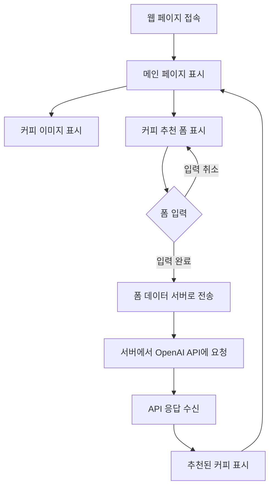

# 커피 뭐 먹을까?

## 목표와 기능

### 목표
- 다양한 커피 종류들 사이 오늘 먹고 싶은 커피 고르기
- 어떠한 맛은 원하지만 커피의 이름을 모를 때
- 매일 똑같은 커피는 싫지만 고르는 시간이 아까울 때

### 기능
- Ghat GPT를 사용한 빠른 커피 추천
- 맛과 향, 온도 등 취향을 고려한 커피 추천
- 추천된 커피에 대한 간단한 설명

## 개발 환경 및 배포 URL
### 개발환경
- HTML
- CSS
- JavaScript
### 배포 URL
- https://neysin.github.io/GPT-website/

## 흐름도


## 폴더 구조
```
GPT-Website
├── images
│   └── cafe_img.jpg
│   └── coffee_logo.png
├── js
│   └── gpt.js
├── styles
│   └── style.css
└── index.html
```

## WBS


## 와이어 프레임
<table>
    <tr>
        <th>메인 화면</th>
        <th>설명</th>
    </tr>
    <tr>
        <td width="70%">
            
        </td>
        <td>
            <ul>
                <li>사진과 로고 삽입</li>
                <li>질문들에 따른 대답을 넣을 input 공간 만들기</li>
                <li>온도는 radio 버튼을 통해 둘 중 하나만 선택하게 하기</li>
                <li>추천되는 커피에 대한 설명이 출력되는 공간 만들기</li>
            </ul>
        </td>
    </tr>
</table>
<table>
    <tr>
        <th>내용 입력</th>
        <th>설명</th>
    </tr>
    <tr width="70%">
        <td width="70%">
            
        </td>
        <td>
            <ul>
                <li>내용 입력 및 radio 버튼을 클릭 후 커피 추천 버튼을 사용</li>
            </ul>
        </td>
    </tr>
</table>
<table>
    <tr>
        <th>내용 출력</th>
        <th>설명</th>
    </tr>
    <tr>
        <td width="70%">
            
        </td>
        <td>
            <ul>
                <li>버튼 클릭 후 내용 출력 공간에 커피에 대한 추천이 나오는지 확인</li>
            </ul>
        </td>
    </tr>
</table>

## 에러
### HTML
 - main을 전체 컨테이너로 잡아 이미지와 질문리스트를 섹션 두개로 잡아 flex를 통해 정렬을 시켜 볼려했지만 제대로 하지 못함.
 - 이에 대한 이해부족으로 인해 위 두개 섹션의 아래 공백에 결과창을 출력해야 하지만 제대로 정렬이 되지 않아 footer로 아래에 배치
 - 본래는 라디오 버튼을 통해 음료의 온도를 입력받으려 했지만 생각대로 되지않아 텍스트로 입력받음.
### CSS
 - 적재적소에 필요한 요소를 적용시키지 못해 처음 생각한 디자인을 구현하지 못함.
 - 요소들 마다의 간격을 제대로 설정하지 못함.
### JavaScript
 - 질문마다 받은 input값을 사용하여 결과를 도출하려 했지만 잘 되지 않음.
 - input값을 일일이 받는 것이 나은지 form을 통해 한 번에 보내어 처리하는 것이 나은지가 고민.